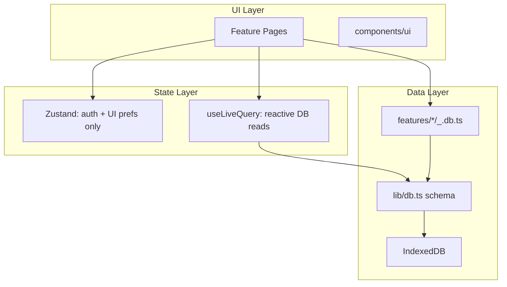
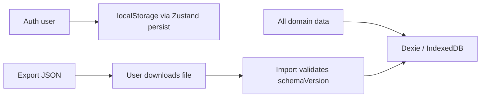

# SplitXL Frontend Architecture Plan

## Current State Assessment

SplitXL is an early bootstrap: **guest login works**, but Dexie schema, UI store, and home routing are incomplete or unused.

| Area | Current | Problem |
|------|---------|---------|
| Structure | `src/modules/auth/` with 7 files across 6 subfolders | Over-modularized for one login form |
| Root split | App in `src/`, UI in `components/`, DB in `lib/` | Two mental roots; inconsistent imports (`@/src/modules/...` vs `@/components/...`) |
| Auth persistence | [`auth.service.ts`](src/modules/auth/services/auth.service.ts) + [`auth.store.ts`](src/modules/auth/store/auth.store.ts) both write `localStorage` | Duplicate writes, easy to drift |
| Domain data | [`lib/db.ts`](lib/db.ts) has 3 minimal tables | Missing categories, splits, settlements, budgets, personal vs group distinction |
| Routing | [`App.tsx`](src/App.tsx) redirects logged-in users to `/` but no `/` route exists | Broken post-login flow |
| PWA | Not configured | Offline/install requirements unmet |

**Verdict:** The documented conventions in [`docs/dexie-guide.md`](docs/dexie-guide.md) and [`docs/zustand-guide.md`](docs/zustand-guide.md) are sound. The folder structure and auth module granularity should be simplified before building features.

---

## Target Architecture Principles



1. **Dexie owns all domain data** — no duplicating expenses/groups in Zustand.
2. **Zustand owns session + UI prefs only** — auth user, theme, sidebar, active group.
3. **Feature colocation** — each feature folder holds its page(s) + DB helpers in **2-4 files max**.
4. **Thin abstraction for future backend** — feature `*.db.ts` files expose plain async functions; swap internals from Dexie to `fetch()` later without touching pages.
5. **Pure logic in `lib/`** — settlement math, money helpers, import/export validation (testable, no React).

---

## Proposed Folder Structure

Consolidate everything under `src/`. Keep shadcn at `src/components/ui/` (standard, one import path).

```
src/
├── main.tsx
├── index.css
│
├── app/                          # App shell only (3 files)
│   ├── App.tsx
│   ├── routes.tsx                # All routes + lazy imports
│   └── AppLayout.tsx             # Nav, sidebar, outlet
│
├── components/
│   └── ui/                       # shadcn primitives (move from root)
│
├── stores/                       # Global Zustand only (2 files)
│   ├── auth.store.ts
│   └── ui.store.ts
│
├── lib/                          # Shared non-feature code
│   ├── db.ts                     # Dexie schema, types, singleton
│   ├── db-migrate.ts             # Version migrations + seed defaults
│   ├── money.ts                  # Format, round, sum (avoid float bugs)
│   ├── settlement.ts             # Net-balance + debt simplification
│   ├── export-import.ts          # JSON backup/restore + validation
│   └── utils.ts                  # cn()
│
└── features/                     # One folder per product area
    ├── auth/
    │   ├── LoginPage.tsx         # Page + form UI
    │   └── auth.ts               # createGuestUser, validation
    ├── dashboard/
    │   └── DashboardPage.tsx
    ├── expenses/
    │   ├── ExpensesPage.tsx      # List, filters, CRUD UI
    │   └── expenses.db.ts        # Dexie CRUD + queries
    ├── categories/
    │   ├── CategoriesPage.tsx
    │   └── categories.db.ts
    ├── groups/
    │   ├── GroupsPage.tsx
    │   ├── GroupDetailPage.tsx   # Members, expenses, budget tab
    │   └── groups.db.ts
    ├── settlements/
    │   ├── SettlementsPanel.tsx  # Used inside GroupDetailPage
    │   └── settlements.db.ts
    ├── reports/
    │   └── ReportsPage.tsx
    └── settings/
        └── SettingsPage.tsx      # Import/export, theme, profile
```

**What we remove:** `hooks/`, `services/`, `types/`, `utils/`, `pages/`, `components/` subfolders inside each module. A solo dev opens `features/expenses/` and sees the whole feature.

**Path alias:** Change `@/*` → `./src/*` in [`tsconfig.app.json`](tsconfig.app.json) and [`vite.config.ts`](vite.config.ts) so imports are consistently `@/features/expenses/expenses.db`.

---

## Data Models

Expand [`lib/db.ts`](lib/db.ts) with a complete schema. Store money as **integer minor units** (paise for INR) internally; format to ₹ in UI via `lib/money.ts`. This avoids floating-point settlement bugs.

### Core entities

```ts
// lib/db.ts (conceptual)

interface AuthUser {
  userId: string
  deviceId: string
  displayName: string
}

interface Category {
  id: string
  name: string
  icon?: string
  color?: string
  scope: "global" | "group" | "private"
  groupId?: string       // required when scope = "group"
  ownerUserId?: string   // required when scope = "private"
  isArchived: boolean
  createdAt: string
}

interface PersonalExpense {
  id: string
  ownerUserId: string
  title: string
  amountPaise: number
  categoryId: string
  date: string           // YYYY-MM-DD for easy month/year filters
  notes?: string
  createdAt: string
  updatedAt: string
}

interface Group {
  id: string
  name: string
  description?: string
  budgetPaise?: number
  createdByUserId: string
  isArchived: boolean
  createdAt: string
  updatedAt: string
}

interface GroupMember {
  id: string
  groupId: string
  userId: string         // local user id OR synthetic id for manual members
  displayName: string
  isActive: boolean
  joinedAt: string
}

type SplitMethod = "equal_all" | "equal_selected" | "manual" | "percentage"

interface GroupExpense {
  id: string
  groupId: string
  title: string
  amountPaise: number
  categoryId: string
  date: string
  notes?: string
  paidByUserId: string
  splitMethod: SplitMethod
  splitData: SplitData     // JSON-safe discriminated union
  createdAt: string
  updatedAt: string
}

type SplitData =
  | { method: "equal_all" }
  | { method: "equal_selected"; memberIds: string[] }
  | { method: "manual"; shares: Record<string, number> }      // userId -> paise
  | { method: "percentage"; shares: Record<string, number> }  // userId -> 0-100

interface SettlementRecord {
  id: string
  groupId: string
  fromUserId: string
  toUserId: string
  amountPaise: number
  status: "pending" | "paid"
  paidAt?: string
  note?: string
  createdAt: string
}

interface AppMeta {
  id: "meta"
  schemaVersion: number
  lastExportAt?: string
}
```

### Dexie tables and indexes

```ts
// version(1) — replace current minimal schema
categories:       "id, scope, groupId, ownerUserId, isArchived"
personalExpenses: "id, ownerUserId, categoryId, date, [ownerUserId+date]"
groups:           "id, createdByUserId, isArchived"
groupMembers:     "id, groupId, userId, [groupId+userId]"
groupExpenses:    "id, groupId, paidByUserId, categoryId, date, [groupId+date]"
settlements:      "id, groupId, fromUserId, toUserId, status"
appMeta:          "id"
```

Compound indexes `[ownerUserId+date]` and `[groupId+date]` support month/year/range filters efficiently.

### Settlement algorithm (pure, in `lib/settlement.ts`)

1. For each group expense, compute each member's share from `splitData`.
2. Build net balance per member: `paid - owed`.
3. Run greedy debt simplification (standard approach for small groups).
4. Compare computed debts with `SettlementRecord` where `status = "paid"` to show remaining balances.
5. When user marks paid, insert/update a `SettlementRecord` — do not mutate expense rows.

---

## State Management

| Concern | Tool | Location |
|---------|------|----------|
| Auth session | Zustand + `persist` | `stores/auth.store.ts` |
| Theme, sidebar, active group | Zustand (no persist or persist theme only) | `stores/ui.store.ts` |
| Expenses, groups, categories | Dexie + `useLiveQuery` | read in pages; write via `*.db.ts` |
| Form inputs, modals, tabs | `useState` in page | local to component |

**Fix auth duplication:** Remove manual `localStorage` from auth service. Only Zustand `persist` writes `auth_user`. [`auth.ts`](src/modules/auth/services/auth.service.ts) becomes pure logic: `createGuestUser()` returns `AuthUser`; caller calls `setUser()`.

**Do not create** per-feature Zustand stores for DB data — that duplicates Dexie and breaks `useLiveQuery` reactivity.

Example reactive read pattern:

```ts
// features/expenses/ExpensesPage.tsx
const userId = useAuthStore(s => s.user?.userId)
const expenses = useLiveQuery(
  () => userId
    ? db.personalExpenses.where("ownerUserId").equals(userId).reverse().sortBy("date")
    : [],
  [userId]
)
```

---

## Local Persistence Strategy



| Storage | Data | Why |
|---------|------|-----|
| IndexedDB (Dexie) | Categories, expenses, groups, members, settlements, meta | Large, structured, offline-capable |
| localStorage | Auth user, optional theme | Small, sync read on boot |
| JSON file export | Full snapshot | Cross-device transfer |

**Import/export** (`lib/export-import.ts`):
- Export: `{ schemaVersion, exportedAt, data: { categories, personalExpenses, groups, ... } }`
- Import: validate with a lightweight schema check (Zod recommended as sole dependency for validation), optionally regenerate `userId` while preserving data, run Dexie migration if `schemaVersion` is older.
- Use Dexie transactions for atomic restore.

**Migrations:** Never edit existing Dexie versions; add `version(n+1).stores(...)` in `db-migrate.ts`. Seed default global categories on first run.

**PWA:** Add `vite-plugin-pwa` with workbox caching for static assets; app works offline because data is local.

---

## Routing and Layout

[`app/routes.tsx`](src/App.tsx):

| Route | Page | Guard |
|-------|------|-------|
| `/login` | `LoginPage` | Public |
| `/` | `DashboardPage` | Auth |
| `/expenses` | `ExpensesPage` | Auth |
| `/categories` | `CategoriesPage` | Auth |
| `/groups` | `GroupsPage` | Auth |
| `/groups/:id` | `GroupDetailPage` | Auth |
| `/reports` | `ReportsPage` | Auth |
| `/settings` | `SettingsPage` | Auth |

`AppLayout.tsx`: responsive sidebar (desktop) / bottom nav (mobile), `<Outlet />`, reads `useUIStore` + `useAuthStore`.

---

## Security and Best Practices (Frontend-Only)

- **Validate all import JSON** before writing to Dexie; reject unknown `schemaVersion` or malformed amounts.
- **Sanitize display names** (trim, max length — already started in guest login).
- **No secrets in storage** — guest IDs are identifiers, not credentials.
- **Auth guard on routes** — redirect unauthenticated users to `/login`.
- **Future auth hook point:** define `AuthProvider` interface in `lib/auth-port.ts` with `getCurrentUser()`; today it reads Zustand, later it reads JWT session.
- **Consistent IDs:** `crypto.randomUUID()` everywhere.
- **Transactions:** group create + add creator as member; import restore; settlement mark-paid — all wrapped in `db.transaction()`.

---

## Future Backend Integration (No Major Refactor)

Each `*.db.ts` file is the swap boundary:

```ts
// Today
export async function addPersonalExpense(input) {
  await db.personalExpenses.add(...)
}

// Future — same signature, different impl
export async function addPersonalExpense(input) {
  return api.post("/expenses", input)
}
```

Pages and `useLiveQuery` hooks change only when moving to server-sync (replace with TanStack Query). Types in `lib/db.ts` become shared contract with API.

---

## Development Roadmap

### Phase 1 — Foundation (MVP shell)
- Restructure folders; fix path aliases
- Consolidate auth (remove duplicate localStorage)
- Complete Dexie schema + default category seed
- AppLayout + all routes (placeholder pages OK)
- Fix post-login redirect to dashboard

### Phase 2 — Personal Expenses (MVP core)
- Categories CRUD (global defaults + custom private)
- Personal expense CRUD
- Filters: category, date range, month, year
- Basic personal dashboard stats (month total, category pie)

### Phase 3 — Groups and Splitting
- Group CRUD + archive + optional budget
- Member add/remove (local synthetic members OK without backend)
- Group expense form with all 4 split methods
- Split validation (shares must sum to total)

### Phase 4 — Settlements
- `lib/settlement.ts` net-balance engine
- Settlements panel in group detail
- Mark as paid + settlement history

### Phase 5 — Budget and Dashboard
- Personal + group budget progress bars
- Group dashboard: spending, outstanding settlements
- Charts via **Recharts** (pie, bar, line)

### Phase 6 — PWA and Data Portability
- `vite-plugin-pwa` (manifest, icons, service worker)
- JSON export/import in Settings
- Schema migration path tested

### Phase 7 — Reports (Advanced)
- Printable report views
- PDF export via **@react-pdf/renderer** or print-to-PDF CSS
- Optional CSV export for expenses

---

## Risks and Pre-Implementation Fixes

| Risk | Mitigation |
|------|------------|
| Float money errors | Store `amountPaise` as integers; format in UI |
| Schema churn | Design full schema in Phase 1; use Dexie versioning from day one |
| Over-abstraction | Max 4 files per feature; no repository interfaces until backend exists |
| `useLiveQuery` loading flash | Consistent skeleton/empty states; handle `undefined` |
| Large import corrupting DB | Validate + transactional replace; offer merge vs replace |
| Settlement edge cases (manual split not summing) | Validate on save; show inline error |
| Chart bundle size | Lazy-load Recharts on dashboard/reports routes |
| Auth + import identity clash | On import, prompt: keep identity or generate new `userId` |
| Current broken `/` route | Fix in Phase 1 before any feature work |

---

## Migration from Current Code

1. Move [`components/ui/*`](components/ui/) → `src/components/ui/`
2. Move [`lib/*`](lib/) → `src/lib/`
3. Collapse [`src/modules/auth/*`](src/modules/auth/) → `src/features/auth/LoginPage.tsx` + `auth.ts`
4. Move [`src/store/ui.store.ts`](src/store/ui.store.ts) → `src/stores/ui.store.ts`
5. Replace [`src/App.tsx`](src/App.tsx) with `src/app/App.tsx` + `routes.tsx` + `AppLayout.tsx`
6. Delete empty `src/modules/` tree
7. Update `components.json` paths for shadcn CLI
8. Expand `db.ts` schema (breaking change OK — no production users yet)

---

## Recommended Dependencies to Add (Later Phases)

- **zod** — import validation, form schemas
- **recharts** — dashboard charts
- **vite-plugin-pwa** — offline PWA
- **@react-pdf/renderer** (Phase 7) — PDF reports
- **date-fns** — date filtering/formatting (lightweight vs moment)

Do not add TanStack Query, Redux, or a DI framework until a backend exists.
