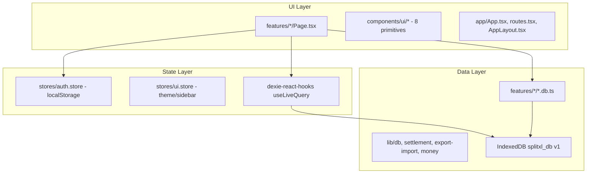
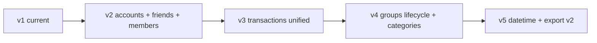

# SplitXL Phase 2 — Architecture & Implementation Plan

## Current Architecture Audit

### What exists today (v1 baseline)

SplitXL is a **local-first React PWA** aligned with the original [frontend architecture plan](d:/Personal/SplitXL/.cursor/plans/frontend_architecture_review_f625b533.plan.md). All v1 roadmap todos are marked completed.



| Layer | Status | Notes |
|-------|--------|-------|
| Feature colocation | Complete | 37 TS/TSX files under `src/` |
| Dexie as domain SSOT | Complete | 7 tables, reactive reads |
| Zustand session-only | Partial | `AuthUser` still in localStorage, not Dexie |
| `*.db.ts` swap boundary | Complete | Pattern ready for backend |
| PWA | Configured | `vite-plugin-pwa` |
| Reports + PDF | Basic | `@react-pdf/renderer` in place |
| Dashboard analytics | Personal only | Recharts on dashboard |
| Import/export | Partial | JSON replace-only; no merge, no account in export |
| Tests | **None** | No vitest/jest; zero test files |
| Migrations | **Stub only** | First-run seed in [`db-migrate.ts`](d:/Personal/SplitXL/src/lib/db-migrate.ts); no `version(2+)` |

### Comparison to original architecture plan

| Original plan item | Built? | Gap |
|--------------------|--------|-----|
| Full Dexie schema v1 | Yes | Matches [`db.ts`](d:/Personal/SplitXL/src/lib/db.ts) |
| Dexie version upgrades | **No** | Only `version(1)`; `AppMeta.schemaVersion` is write-only |
| Import merge + identity remap | **No** | `newUser` stubbed (`void options.newUser`) |
| Confirmation modals | **No** | Destructive actions are immediate |
| Group edit UI | **No** | `updateGroup()` exists, no UI |
| Group expense edit UI | **No** | `updateGroupExpense()` exists, no UI |
| Group-scoped categories UI | **No** | Schema supports `scope: "group"`, UI only global/private |
| Settlement lifecycle | **Partial** | Computed debts + mark-paid history; no lock/cancel/auto-complete |
| Friends / contacts | **No** | Not in schema or UI |
| Timeline UI | **No** | Flat expense cards only |
| Integrity validation | **No** | No orphan checks, no cascade rules |

---

## Current Schema Audit

**Database:** `splitxl_db` · **Dexie version:** 1 · **`SCHEMA_VERSION`:** 1

### Tables (7)

| Table | Indexed fields | Key gaps vs Phase 2 spec |
|-------|----------------|--------------------------|
| `categories` | id, scope, groupId, ownerUserId, isArchived | Uses Lucide `icon` strings not emoji; scope `"private"` not `"personal"`; no `updatedAt` |
| `personalExpenses` | id, ownerUserId, categoryId, date, [ownerUserId+date] | Date-only (`YYYY-MM-DD`); no `transactionDateTime` |
| `groups` | id, createdByUserId, isArchived | No `status` enum; archive ≠ lifecycle status |
| `groupMembers` | id, groupId, userId, [groupId+userId] | Name-only contact info; synthetic `userId`; no email/phone/friend link; no updatedAt |
| `groupExpenses` | id, groupId, paidByUserId, categoryId, date, [groupId+date] | Expenses only; splits keyed by `userId` not `memberId` |
| `settlements` | id, groupId, fromUserId, toUserId, status | Only `"paid"` rows created; `"pending"` unused; separate from expenses |
| `appMeta` | id | Singleton metadata only |

### Missing tables (Phase 2 spec)

| Entity | Required fields (summary) |
|--------|---------------------------|
| `accounts` | id, displayName, email?, phone?, createdAt, updatedAt |
| `friends` | id, displayName, email?, phone?, avatar?, notes?, createdAt, updatedAt, isArchived |
| `transactions` (unified) | type: expense \| refund \| settlement_payment; positive amounts; links to group/members/category; refund/settlement metadata |
| `settings` (optional) | Account-scoped preferences if not kept in Zustand |

### Identity & FK model today

- **No referential integrity** — all FKs are application-level
- **Auth split:** `AuthUser` in localStorage ([`auth.store.ts`](d:/Personal/SplitXL/src/stores/auth.store.ts)); domain rows reference `ownerUserId` / `createdByUserId` loosely
- **Member identity conflation:** [`addGroupMember`](d:/Personal/SplitXL/src/features/groups/groups.db.ts) assigns random UUID as `userId`; same person in two groups = two unrelated IDs
- **Settlement engine** ([`settlement.ts`](d:/Personal/SplitXL/src/lib/settlement.ts)) keys all shares/balances by `member.userId`

### Export format today

[`export-import.ts`](d:/Personal/SplitXL/src/lib/export-import.ts) exports 6 tables, no account/friends, no `exportVersion`, rejects newer schema but **does not migrate older schemas**.

---

## Missing Features Audit (by Phase)

| Phase | Feature | Current state |
|-------|---------|---------------|
| **1** | Friend CRUD + archive | Missing entirely |
| **1** | Group member refactor (email/phone/friend link) | Name-only |
| **1** | Unified transactions (expense/refund/settlement_payment) | Separate `groupExpenses` + `settlements` |
| **2** | Group status lifecycle | Only `isArchived` boolean |
| **2** | Start settlement lock | Not implemented |
| **2** | Auto-settled when debts = 0 | Not implemented |
| **2** | Cancel settlement (no payments) | Not implemented |
| **3** | Edit/delete/restore group | Archive only; no delete/restore UI |
| **4** | Expandable transaction timeline | Flat list; no edit group expense UI |
| **5** | Category emoji + personal scope | Lucide icons; `"private"` scope |
| **6** | Group + personal insights pages | Dashboard personal charts only |
| **7** | Full group history report (no date filter) | Date-range reports exist |
| **8** | Dashboard status metrics + pagination | Basic stats; no status filters |
| **9** | ConfirmationModal | Missing; no Dialog component |
| **10** | Dark mode overlay fixes | Known issues in Select/Popover |
| **11** | Date+time picker + timezone-safe storage | Date-only strings |
| **12** | Logo placeholder component | Not present |
| **13** | Account in Dexie, merge import, deletion, integrity | Replace import only; no tests |

---

## Proposed Migration Plan

**Principle:** Schema + migration + tests before UI for each phase. Never edit existing Dexie versions; chain new versions with `.upgrade()` hooks in [`db-migrate.ts`](d:/Personal/SplitXL/src/lib/db-migrate.ts).

### Schema version roadmap



#### Dexie v2 — Foundation entities (Phase 1 core)

**New tables:**
```ts
accounts:  "id, email, phone, createdAt"
friends:   "id, ownerAccountId, email, phone, isArchived, [ownerAccountId+isArchived]"
```

**Alter `groupMembers` (via upgrade, not store string change alone):**
- Add: `email?`, `phone?`, `linkedFriendId?`, `linkedAccountId?`, `createdAt`, `updatedAt`
- **Migrate split/settlement keys:** `userId` → `memberId` (= existing `groupMembers.id`)
  - Rewrite `splitData.memberIds` and `splitData.shares` keys
  - Rewrite `paidByUserId`, `fromUserId`, `toUserId` to member IDs
  - Drop deprecated `userId` field after migration
- Creator member: set `linkedAccountId` from session account

**Account bootstrap upgrade:**
- If localStorage `auth_user` exists → create `accounts` row, link creator members
- Persist active account id in Zustand (reference Dexie id)

**New modules:** [`features/friends/friends.db.ts`](d:/Personal/SplitXL/src/features/friends/friends.db.ts), [`lib/db-integrity.ts`](d:/Personal/SplitXL/src/lib/db-integrity.ts) (initial version)

#### Dexie v3 — Unified transactions (Phase 1 completion)

**New table:**
```ts
transactions: "id, groupId, type, memberId, categoryId, transactionDateTime, [groupId+type], [groupId+transactionDateTime]"
```

**Fields (conceptual):**
```ts
type TransactionType = "expense" | "refund" | "settlement_payment"

interface Transaction {
  id: string
  groupId: string
  type: TransactionType
  title: string
  amountPaise: number          // always positive
  categoryId?: string          // expense/refund only
  paidByMemberId: string
  splitMethod?: SplitMethod    // expense/refund only
  splitData?: SplitData        // keys = memberId
  refundOfTransactionId?: string
  settlementFromMemberId?: string  // settlement_payment
  settlementToMemberId?: string
  notes?: string
  transactionDateTime: string  // ISO UTC
  createdAt: string
  updatedAt: string
}
```

**Upgrade hook:**
1. Copy each `groupExpenses` row → `transactions` (`type: "expense"`, remap FKs to memberId)
2. Copy each `settlements` row (`status === "paid"`) → `transactions` (`type: "settlement_payment"`)
3. Verify integrity; then `clear()` legacy tables (keep tables empty for rollback window, remove from TypeScript in v4)

**Update [`settlement.ts`](d:/Personal/SplitXL/src/lib/settlement.ts):** operate on `Transaction[]` instead of `GroupExpense[]` + `SettlementRecord[]`

#### Dexie v4 — Group lifecycle + categories (Phases 2 + 5)

**`groups` additions:**
```ts
status: "active" | "settlement_in_progress" | "settled" | "archived"
settlementStartedAt?: string
settledAt?: string
```
- Map existing `isArchived: true` → `status: "archived"`; deprecate `isArchived`

**`categories` additions:**
- Add `emoji?: string`
- Rename scope `"private"` → `"personal"` in upgrade
- Map default Lucide icons → emoji (🍔 Food, 🚕 Transport, etc.)
- Add `updatedAt`

#### Dexie v5 — DateTime + export format (Phases 11 + 13)

- `personalExpenses`: add `transactionDateTime`; migrate `date` → start-of-day ISO
- Export payload v2:
```ts
{
  exportVersion: 2,
  schemaVersion: 5,
  exportedAt: ISO,
  account: Account,
  data: { friends, categories, personalExpenses, groups, groupMembers, transactions, settings }
}
```
- Import pipeline: version router → `migrateExportV1ToV5()` chain

### Per-operation integrity & cleanup

Create [`lib/db-integrity.ts`](d:/Personal/SplitXL/src/lib/db-integrity.ts):

```ts
validateDatabaseIntegrity(): IntegrityReport  // all FK targets exist
cleanupOrphans(scope: "group" | "account" | "full"): void
assertCleanAfterOperation(op: string): void   // called post-import/delete/migration
```

**Cascade rules to implement in `*.db.ts` (not DB-level):**

| Operation | Must also |
|-----------|-----------|
| Delete/archive group | Block if not allowed by status; cascade or block transactions |
| Delete friend | Clear `linkedFriendId` on members; block if referenced in active settlement |
| Delete category | Reassign or block if referenced |
| Account delete | Clear all owned tables in one transaction |
| Replace import | Backup snapshot → clear all → verify empty → import → validate |

**Backup snapshot for rollback:** Serialize all tables to memory or `sessionStorage` before destructive ops; restore on validation failure.

### Test infrastructure (required before Phase 13)

Add **Vitest** + `fake-indexeddb` (or Dexie's `Dexie.delete()` in test isolation):

```
src/lib/__tests__/export-import.test.ts
src/lib/__tests__/db-integrity.test.ts
src/lib/__tests__/migrations.test.ts
src/lib/__tests__/settlement.test.ts
```

---

## Implementation Phases (ordered)

### Phase 1 — Data Model Refactor (BLOCKING)

**Order:** v2 migration → friends.db.ts → member refactor UI flows → v3 transactions → update settlement engine → feature DB layer swap

1. Add `accounts` + migrate localStorage auth
2. Add `friends` table + CRUD + validation (email OR phone)
3. Refactor `groupMembers` + member creation triflow (select friend / new member / save as friend)
4. Unified `transactions` table; deprecate direct `groupExpenses`/`settlements` usage
5. Refund creation reduces balances (negative effect in settlement math, positive stored amount)
6. Gate expense edits via group status (stub rules now, full enforcement in Phase 2)

**Files touched:** [`db.ts`](d:/Personal/SplitXL/src/lib/db.ts), [`db-migrate.ts`](d:/Personal/SplitXL/src/lib/db-migrate.ts), [`settlement.ts`](d:/Personal/SplitXL/src/lib/settlement.ts), [`groups.db.ts`](d:/Personal/SplitXL/src/features/groups/groups.db.ts), new `friends.db.ts`, new `transactions.db.ts`

### Phase 2 — Settlement Lifecycle

1. Add `groups.status` + migration from v4 (can ship v4 schema here)
2. `startSettlement(groupId)` — confirmation modal, set `settlement_in_progress`, enforce write guards in all `*.db.ts` mutators
3. `cancelSettlement(groupId)` — allowed only if zero `settlement_payment` transactions
4. Watch debts in UI/`useLiveQuery`; when all zero → auto `settled`, permanent read-only
5. Update [`SettlementsPanel.tsx`](d:/Personal/SplitXL/src/features/settlements/SettlementsPanel.tsx)

### Phase 3 — Group Management

1. Edit group form (uses existing `updateGroup`)
2. Hard delete group (cascade transactions, members, group categories) with confirmation
3. Archive/restore via `status: "archived"` + archived filter on [`GroupsPage.tsx`](d:/Personal/SplitXL/src/features/groups/GroupsPage.tsx)

### Phase 4 — Expense Timeline

1. New `TransactionTimeline` component (collapsed/expanded states)
2. Wire view/edit/delete with group status guards
3. Show refund + settlement metadata in expanded view

### Phase 5 — Category Enhancements

1. Emoji field + default seed update
2. Personal/group/global scopes in [`CategoriesPage.tsx`](d:/Personal/SplitXL/src/features/categories/CategoriesPage.tsx)
3. Emoji + name in all Select dropdowns and timeline

### Phase 6 — Analytics & Insights

1. New route `/insights` or tabs under group detail
2. Group-scoped: category pie, member contribution pie, member spending bar, monthly bar, budget vs actual, settlement progress
3. Personal: monthly spend, category breakdown, friend payments, refunds, trends, date range

### Phase 7 — Reporting

1. Extend [`GroupReportDocument.tsx`](d:/Personal/SplitXL/src/features/reports/GroupReportDocument.tsx) — full history, no date picker
2. Include refunds, settlements, charts, budget analysis
3. PDF export (already have `@react-pdf/renderer`)

### Phase 8 — Dashboard Enhancements

1. Status metric cards (active / settlement_in_progress / settled / archived)
2. Click-to-filter group list; active groups first
3. Pagination on group list

### Phase 9 — UX & Safety

1. Add shadcn `Dialog` / `AlertDialog` → [`ConfirmationModal.tsx`](d:/Personal/SplitXL/src/components/ConfirmationModal.tsx)
2. Wire all destructive actions listed in spec

### Phase 10 — UI Fixes

1. Theme tokens for Select, Popover, Menu, DatePicker overlays
2. Category dropdown: emoji + name

### Phase 11 — Date & Time

1. `DateTimePicker` modal component
2. Store `transactionDateTime` as ISO UTC; display local date + time via `date-fns`
3. Migrate existing date-only records

### Phase 12 — Branding

1. [`LogoPlaceholder.tsx`](d:/Personal/SplitXL/src/components/LogoPlaceholder.tsx) — swap asset via config/prop, no code change needed later

### Phase 13 — Account, Import/Export, Deletion

1. Account CRUD in settings; single active account enforcement
2. Export v2 with account + friends + settings
3. Import preview modal; replace vs merge modes
4. Merge: duplicate detection (categories by name+scope, friends by email/phone, transactions by id)
5. Account deletion flow (export & delete / delete / cancel)
6. Full integrity test suite

---

## Potential Risks

| Risk | Severity | Mitigation |
|------|----------|------------|
| **memberId migration breaks splits/settlements** | Critical | Upgrade hook with ID mapping table; validate balances before/after; unit tests on real v1 export fixtures |
| **Unified transactions refactor touches all group features** | High | Phase 1 sub-step: read adapter layer so UI migrates incrementally; feature-flag old tables until validated |
| **localStorage auth → Dexie account desync** | High | Single bootstrap migration on first v2 open; export includes account; import sets active session |
| **Merge import duplicate logic errors** | High | Explicit dedup keys; preview counts; transactional rollback |
| **Settlement lock bypass via direct DB calls** | Medium | Enforce guards in every `*.db.ts` mutator, not just UI |
| **Scope rename `private` → `personal`** | Medium | Upgrade transforms all rows; Zod schemas accept both during transition |
| **No test framework today** | Medium | Add Vitest in Phase 1 before migrations ship |
| **Large dataset import performance** | Medium | Batch `bulkPut` in chunks; progress UI |
| **Category icon → emoji data loss** | Low | Migration map Lucide names to default emoji; keep `icon` field deprecated one version |
| **Dexie table removal** | Low | Clear legacy tables but keep store definitions one version for safe rollback |

---

## Recommended First Sprint (Phase 1 only)

1. Add Vitest + `fake-indexeddb`
2. Implement `lib/db-integrity.ts` + baseline tests
3. Ship Dexie **v2** (accounts, friends, member refactor + ID remap)
4. Ship Dexie **v3** (transactions + settlement engine update)
5. Add `features/friends/` page + member creation flows
6. Update export/import to handle v1 backups via `migrateExportV1ToCurrent()`
7. Manual QA checklist: existing v1 user data opens cleanly, balances unchanged

**Do not start UI enhancements (Phases 4–12) until Phase 1 migrations pass integrity tests.**

---

## Key Design Decisions (locked for implementation)

1. **Unified `transactions` table** replaces `groupExpenses` + `settlements` (not parallel systems)
2. **Split/settlement FK key = `groupMembers.id`** (not synthetic `userId`)
3. **Category scope `"personal"`** replaces `"private"` (with migration alias)
4. **Category emoji** is a new field; Lucide `icon` deprecated after v4
5. **`groups.status`** replaces `isArchived` as the lifecycle source of truth
6. **Single account per device** — no multi-account switching UI
7. **Amounts always positive** — refunds/settlements affect balances in [`settlement.ts`](d:/Personal/SplitXL/src/lib/settlement.ts) logic
