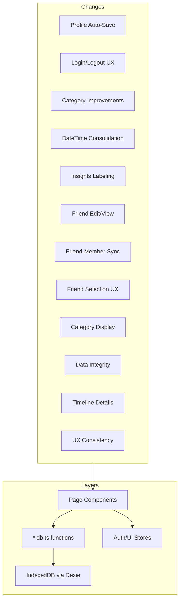
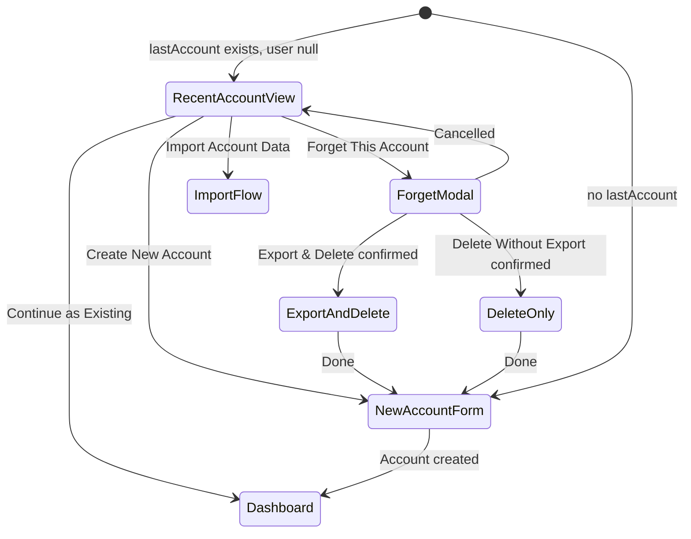

# Design Document — SplitXL Incremental Changes

## Overview

This document describes the design for 12 incremental improvements to SplitXL. The changes are all UI and application-layer — no new Dexie migrations are needed. The implementation touches: auth/login flow, settings, categories, expenses, friends, group members, transaction timeline, and insights.

---

## Architecture

All changes follow the existing architecture principles:

- Domain data mutations via `features/*/_.db.ts` functions
- Reactive reads via `useLiveQuery`
- Zustand only for session state (auth user, theme, sidebar)
- No new global stores



---

## Components and Interfaces

### Change 1 — Profile Auto-Save

**File:** `src/features/settings/SettingsPage.tsx`

Remove the explicit `<Button onClick={handleSaveProfile}>Save Profile</Button>`. Replace the Account card's content with a `<form onSubmit={handleSaveProfile}>` wrapping all profile inputs. The submit button will read "Update Profile" and live inside the form. Success/error feedback messages remain.

Auto-save on blur is an alternative, but submit-on-form is preferred here since multiple fields exist and the user should control when to commit.

### Change 2 — Login/Logout Experience

**Files:**
- `src/features/auth/LoginPage.tsx` — redesigned to support recent account recall
- `src/stores/auth.store.ts` — persist `lastAccount` separately from `user`
- `src/features/accounts/accounts.db.ts` — `deleteAccountData` already exists; used here

**Design:**

`auth.store.ts` will persist two keys:
- `user` — current active session (cleared on logout)
- `lastAccount` — last known account snapshot `{ accountId, displayName }` (persisted on logout, cleared on "Forget")

`LoginPage.tsx` will show two states:
1. **Recent Account View** (when `lastAccount` exists but `user` is null): shows the account name, and four action buttons
2. **New Account Form** (when no `lastAccount`): shows the existing name-entry form

The "Forget This Account" flow uses a multi-step modal:
- Step 1: Warning modal with three options (Cancel, Export & Delete, Delete Without Export)
- On Export & Delete: calls `exportAllData()` + `downloadExport()` + `deleteAccountData()` + `logout()` + clears `lastAccount`
- On Delete Without Export: calls `deleteAccountData()` + `logout()` + clears `lastAccount`

The import flow on the login screen reuses `parseImportFile` and `importAllData` with mode "replace".



### Change 3 — Category System Improvements

**Files:**
- `src/lib/db-migrate.ts` — expand `DEFAULT_CATEGORIES` to 10 entries
- `src/features/categories/CategoriesPage.tsx` — remove color picker, allow editing system categories (name + emoji), update edit form

**Default categories (full list):**
```ts
🍔 Food, 🚕 Transport, 🏨 Hotel, 🎟️ Tickets, 🛒 Shopping,
🎮 Entertainment, 💊 Medical, 🏠 Rent, 📚 Education, ✈️ Travel
```

**Edit rules:**
- System (global) categories: edit name + emoji allowed, no delete
- Custom (personal/group) categories: edit name + emoji + delete with confirmation

The create form removes the color input. The edit inline panel shows emoji + name fields.

### Change 4 — Date and Time Field Consolidation

**File:** `src/features/expenses/ExpensesPage.tsx`

Remove the `<Input type="date" value={form.date}>` field from the personal expense form. The `form.date` state field is replaced by `transactionDateTime` only. The `dateToTransactionDateTime` helper in `expenses.db.ts` is kept for backward compat in filters.

The displayed button `formatDateTime(transactionDateTime)` becomes the sole date/time entry point.

Filters still use date-based comparisons — derive the date from `transactionDateTime` using `isoToDateString()` from `DateTimePickerModal` when filtering.

### Change 5 — Insights Clarification and Labeling

**File:** `src/features/insights/InsightsPage.tsx`

Every chart card gets a `CardDescription` showing the time period and calculation basis.

**Member Insights** — new per-member stats table replacing the existing combined "Member Contributions" pie:

| Metric | Calculation |
|--------|-------------|
| Amount Paid | Sum of `amountPaise` for transactions where `paidByMemberId = member.id` and type is `expense` or `refund` |
| Amount Consumed | Sum of `share` for member across all expense transactions (from `computeShares`) |
| Net Position | `balances[member.id]` from `computeNetBalances` (positive = receivable, negative = payable) |
| Expense Count | Count of transactions where the member is in the split participants |

**Settlement Progress** — new breakdown card:

| Field | Value |
|-------|-------|
| Total Debt | `simplifyDebts(balances).reduce((s, d) => s + d.amountPaise, 0)` before any payments |
| Settled Amount | Sum of `settlement_payment` transactions |
| Remaining Amount | `Total Debt - Settled Amount` |
| Completion % | `Settled / Total * 100` |

The `computeSettlementProgress` helper will be added to `lib/settlement.ts`.

### Change 6 — Friend Management (View, Edit, Delete)

**File:** `src/features/friends/FriendsPage.tsx`

Add:
- Edit button on each friend card → inline edit form with name, email, phone, notes
- View button → detail panel showing all fields + createdAt
- `updateFriend()` already exists in `friends.db.ts`
- Validation: email OR phone required (already implemented in `validateContact`)

### Change 7 — Friend and Member Synchronization

**Files:**
- `src/features/friends/friends.db.ts` — update `updateFriend` to propagate to linked members
- `src/features/groups/groups.db.ts` — add `updateGroupMember` with sync logic

**`updateFriend` propagation:**
```ts
// After updating friend, find all linked members and update them
const linkedMembers = await db.groupMembers.filter(m => m.linkedFriendId === id).toArray()
for (const member of linkedMembers) {
  await db.groupMembers.update(member.id, { displayName, email, phone, updatedAt })
}
```

**`updateGroupMember` with sync:**
```ts
// If member has linkedFriendId, update the friend and all sibling members
if (member.linkedFriendId) {
  await db.friends.update(member.linkedFriendId, { displayName, email, phone, updatedAt })
  const siblings = await db.groupMembers.filter(m => m.linkedFriendId === member.linkedFriendId && m.id !== id).toArray()
  for (const sibling of siblings) {
    await db.groupMembers.update(sibling.id, { displayName, email, phone, updatedAt })
  }
}
```

Both operations are wrapped in Dexie transactions.

### Change 8 — Friend Selection UX

**File:** `src/features/groups/GroupDetailPage.tsx`

Replace the plain `<Select>` for friend selection with a custom list/radio-style component that renders each friend as a card showing name, email (if present), phone (if present), and a visual indicator if they're already a member.

If a native `<Select>` must be used, the option text becomes: `{name} · {email ?? phone ?? "no contact info"}`.

### Change 9 — Category Display Consistency

**Files affected:**
- `src/features/expenses/ExpensesPage.tsx` — category filter dropdown uses `c.name` only; change to `formatCategoryLabel(c)`
- `src/features/expenses/ExpensesPage.tsx` — expense list cards show `categoryMap[expense.categoryId]` which already uses `formatCategoryLabel`; verify this is correct
- `src/components/TransactionTimeline.tsx` — collapsed view shows category emoji inline; ensure it's visible

`formatCategoryLabel` already returns `{emoji} {name}` — changes are mostly ensuring it's used consistently everywhere, including the filter dropdown.

### Change 10 — Data Integrity

**Files:** `src/features/accounts/accounts.db.ts`, `src/lib/db-integrity.ts`

- After `deleteAccountData()`, call `validateDatabaseIntegrity()` and log/throw if invalid
- The existing `assertCleanAfterOperation` call in `importAllData` is already in place
- After `deleteGroup()`, verify cascade was complete (already implemented; add assertion)
- After `deleteFriend()`, verify linkedFriendId unlink was complete

No new schema changes needed.

### Change 11 — Timeline Detail Improvements

**File:** `src/components/TransactionTimeline.tsx`

**Collapsed view additions:**
- "Paid by {name}" is already rendered. Ensure it uses `formatDateTime` for the date portion, not just the date string.

**Expanded view additions:**
- Split breakdown: compute shares using `computeShares(tx, members)` and display per-member amounts in a table
- Participants list: list all members with a non-zero share (or all active members for `equal_all`)

### Change 12 — UX Consistency

**Files:**
- `src/features/groups/GroupDetailPage.tsx` — add member edit form + view detail panel + confirmation on remove
- `src/features/friends/FriendsPage.tsx` — edit + view (covered in Change 6)
- `src/features/categories/CategoriesPage.tsx` — already has confirmation modal for delete; ensure system categories show informative message

**Member view detail panel:**
- Name, Email, Phone, Linked Friend (name or "Not linked"), Groups count, Created date

**Member edit form:**
- Name, Email, Phone fields
- On save: calls `updateGroupMember()` which handles sync

---

## Data Models

No new tables or migrations needed.

**New/updated application-layer functions:**

```ts
// friends.db.ts
updateFriend(id, changes): Promise<void>  // now also syncs linked members

// groups.db.ts (new)
updateGroupMember(id, changes: { displayName?, email?, phone? }): Promise<void>  // syncs to friend + siblings

// settlement.ts (new helper)
computeSettlementProgress(transactions: Transaction[], balances: Record<string, number>): {
  totalDebt: number
  settledAmount: number
  remainingAmount: number
  completionPct: number
}
```

**`auth.store.ts` — new `lastAccount` field:**
```ts
interface AuthState {
  user: AuthUser | null
  lastAccount: { accountId: string; displayName: string } | null
  setUser: (user: AuthUser) => void
  logout: () => void
  clearLastAccount: () => void
}
```

---

## Correctness Properties

*A property is a characteristic or behavior that should hold true across all valid executions of a system — essentially, a formal statement about what the system should do. Properties serve as the bridge between human-readable specifications and machine-verifiable correctness guarantees.*

### Property 1: Profile save persists all fields

*For any* valid combination of displayName, email, and phone values, after calling the profile save handler, the database account record should contain those exact values.

**Validates: Requirements 1.2**

---

### Property 2: Account deletion leaves no orphans

*For any* account with associated friends, personal expenses, groups, transactions, and categories, after `deleteAccountData()` is called, `validateDatabaseIntegrity()` should return `valid: true`, and no records in any table should reference the deleted account id.

**Validates: Requirements 2.8, 2.9, 2.10, 10.1**

---

### Property 3: Category edit accepts name and emoji for all scopes

*For any* category regardless of scope (global, personal, group), calling `updateCategory(id, { name, emoji })` should result in the category record reflecting the new name and emoji.

**Validates: Requirements 3.3, 3.6**

---

### Property 4: System category deletion is rejected

*For any* category with `scope: "global"`, attempting to call `deleteCategory(id)` should throw an error (or be blocked at the UI level), and the category should remain in the database unchanged.

**Validates: Requirements 3.4**

---

### Property 5: Settlement progress calculation is consistent

*For any* set of transactions in a group, `computeSettlementProgress(transactions, balances).completionPct` equals `settledAmount / totalDebt * 100` (handling the edge case of `totalDebt = 0` returning 100%).

**Validates: Requirements 5.4**

---

### Property 6: Friend contact validation

*For any* friend update where both email and phone are absent (empty/undefined), `updateFriend()` should throw a validation error and the friend record should remain unchanged.

**Validates: Requirements 6.3, 6.4**

---

### Property 7: Friend update propagates to all linked members

*For any* friend that has one or more linked group members, after `updateFriend(id, { displayName, email, phone })`, every group member with `linkedFriendId = id` should have their displayName, email, and phone updated to match the friend's new values.

**Validates: Requirements 7.3**

---

### Property 8: Linked member update propagates bidirectionally

*For any* group member with a non-null `linkedFriendId`, after `updateGroupMember(id, changes)`, the corresponding friend record and all sibling members (same `linkedFriendId`, different `id`) should reflect the same updated values.

**Validates: Requirements 7.1, 7.2**

---

### Property 9: Standalone member update has no side effects

*For any* group member with `linkedFriendId = null`, after `updateGroupMember(id, changes)`, no other records in the database should be modified (verified by comparing snapshots before and after).

**Validates: Requirements 7.4**

---

### Property 10: Category label always includes emoji and name

*For any* category object with a non-empty name and emoji, `formatCategoryLabel(category)` should return a string that contains both the emoji and the name.

**Validates: Requirements 9.1, 9.2, 9.3, 9.4, 9.5, 9.6**

---

### Property 11: Group deletion cascades completely

*For any* group with associated transactions, members, and group-scoped categories, after `deleteGroup(id)`, no records with that `groupId` should remain in `db.transactions`, `db.groupMembers`, or `db.categories`.

**Validates: Requirements 10.3**

---

### Property 12: Friend deletion unlinks all group members

*For any* friend, after `deleteFriend(id)`, no group member in `db.groupMembers` should have `linkedFriendId = id`.

**Validates: Requirements 10.4**

---

### Property 13: Timeline collapsed view renders required fields

*For any* transaction, the rendered collapsed timeline card should contain: the category emoji (or type-specific emoji), the title text, the formatted amount, the formatted date/time, and the payer's display name.

**Validates: Requirements 11.1**

---

### Property 14: Timeline expanded view renders all detail fields

*For any* transaction, the rendered expanded timeline card should contain: category name, split method (if applicable), split breakdown with per-member amounts (if applicable), and the transaction type.

**Validates: Requirements 11.2**

---

## Error Handling

- **Profile save errors**: display inline error message; do not clear form
- **Account deletion failure**: show error toast; no data is deleted partially (all operations are transactional)
- **Category deletion rejection**: show inline informative message (not a modal) for system categories
- **Friend update validation**: inline error below the field, do not dismiss the edit form
- **Sync errors during friend/member update**: wrap in try/catch; show error to user; both the primary record and sync targets are in a single transaction so rollback is atomic
- **Integrity check failure post-import**: surface first issue message to user; snapshot rollback already implemented in `importAllData`

---

## Testing Strategy

### Dual Testing Approach

**Unit tests** verify specific examples, edge cases, and UI rendering:
- Login page renders with/without prior account
- Four action buttons are present in recent-account view
- No "Save Profile" button on settings page
- Category filter dropdown shows emoji+name labels
- Timeline expanded view renders split breakdown

**Property tests** verify universal properties across all inputs using **Vitest** with manual input generation (no external PBT library dependency needed; fast-check can be added if desired):
- All 14 properties above are implemented as property-based tests
- Each test generates randomized inputs (random UUIDs, random amounts, random names)
- Minimum 50 iterations per property

### Property Test Configuration

Each test is tagged with a comment referencing its design property:

```ts
// Feature: splitxl-incremental-changes, Property 7: Friend update propagates to all linked members
// Validates: Requirements 7.3
it.each(generateFriendUpdateCases(50))("friend update propagates to all linked members", async (tc) => { ... })
```

### Test Files

- `src/lib/__tests__/settlement.test.ts` — extend with Property 5 (settlement progress)
- `src/lib/__tests__/db-integrity.test.ts` — extend with Properties 2, 11, 12
- `src/features/categories/__tests__/categories.test.ts` — new, Properties 3, 4, 10
- `src/features/friends/__tests__/friends.test.ts` — new, Properties 6, 7
- `src/features/groups/__tests__/groups.test.ts` — new, Properties 8, 9, 11
